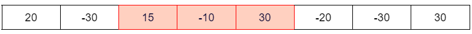
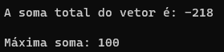

# Exercício 4 de Lista

### **Problema**
---

- Em uma Lista A temos um conjunto de elementos inteiros positivos ou não. Elabore uma função que consiga encontrar neste conjunto a máxima soma.

---

### **Solução**
---

Encontrar a máxima soma de um conjunto de elementos pode ser resumida em encontrar neste, um subconjunto sequencial que com seus valores somados, possuem a maior soma possível dentro daquela lista. 
Aqui podemos ver um vetor com números positivos e negativos e sua máxima soma se encontra entre a 3º e 5º posição, com o resultado de 35.

 

Para o armazenamento dos números na lista, utilizei um <code><em>'for'</em></code> que percorre todo o vetor de tamanho estático <strong>MAXTAM</strong> e utilizando a função <code>rand()</code> é colocado números aleatórios dentro de cada posição do vetor. Para que a lista não possua apenas números positivos, é necessário fazer uma subtração que torne aquele número negativo. No código abaixo é demonstrado como inserir números de -99 a 99 utilizando <code>rand()</code>.

<code><pre>
for (int i = 0; i < MAXTAM; i++){
    item.num = (rand() % 199)-99; //inserção dos inteiros randômicos no vetor da lista
    InsereNaLista(&lista, item);//inserção do vetor na lista
}
</pre></code>

A função criada para procurar a máxima soma é chamada <code>maximaSoma</code>, nesta há a criação de duas novas variáveis do tipo inteiro, a <code><em>maxSoma</code></em> e a <code><em>soma</code></em>. A primeira armazena, inicialmente, o primeiro valor da lista, e a segunda armazena 0. 
Após isso, a função apresenta dois loops, um que percorre toda a lista e o outro mais interno que percorre da posição atual do <code><em>'for'</code></em> externo até o final. 
No loop mais interno ocorre a soma e atribuição do contéudo de cada posição da lista na variável <code><em>soma</code></em> e também há um <code><em>'if'</code></em> que atribui o valor somado a variável <code><em>maxSoma</code></em> caso este seja maior que o valor anteriormente armazenado em <code><em>maxSoma</code></em>. Com isso, o algoritmo consegue encontrar a máxima soma de uma lista estática de tamanho n. 
Além da máxima soma, há também uma função <code><em>somaVetorInteiro</code></em> que somará todos os inteiros daquele vetor apenas para comparação da máxima soma com a soma normal.

---

### **Entrada**
---
<table border="1">
    <tr>
        <td>72</td>
        <td>28</td>
        <td>-78</td>
        <td>-90</td>
        <td>-82</td>
        <td>41</td>
        <td>24</td>
        <td>-8</td>
        <td>-71</td>
        <td>-54</td>
    </tr>
</table>

---

### **Saída**
---

 

---

# Compilação e Execução

O código apresentado possui um arquivo Makefile que realiza todo o procedimento de compilação e execução. Para tanto, temos as seguintes diretrizes de execução:

| Comando                |  Função                                                                                           |                     
| -----------------------| ------------------------------------------------------------------------------------------------- |
|  `make clean`          | Apaga a última compilação realizada contida na pasta build                                        |
|  `make`                | Executa a compilação do programa utilizando o gcc, e o resultado vai para a pasta build           |
|  `make run`            | Executa o programa da pasta build após a realização da compilação                                 |
